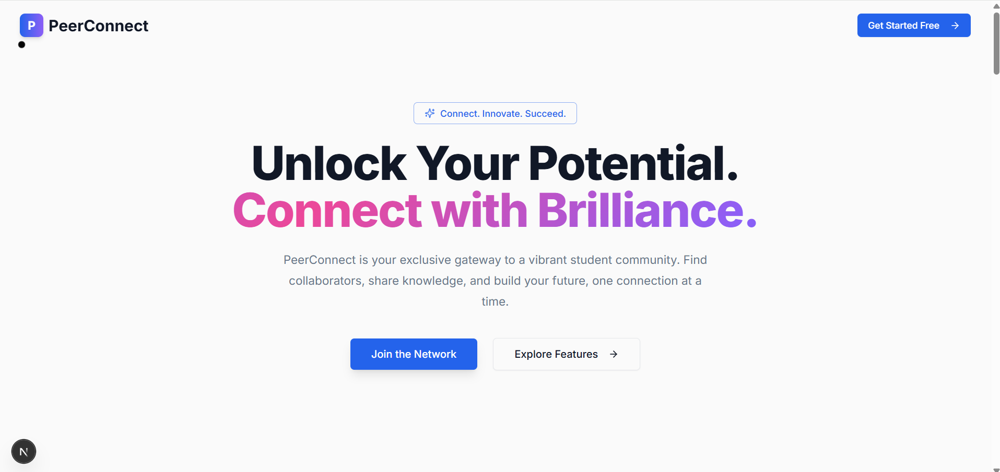
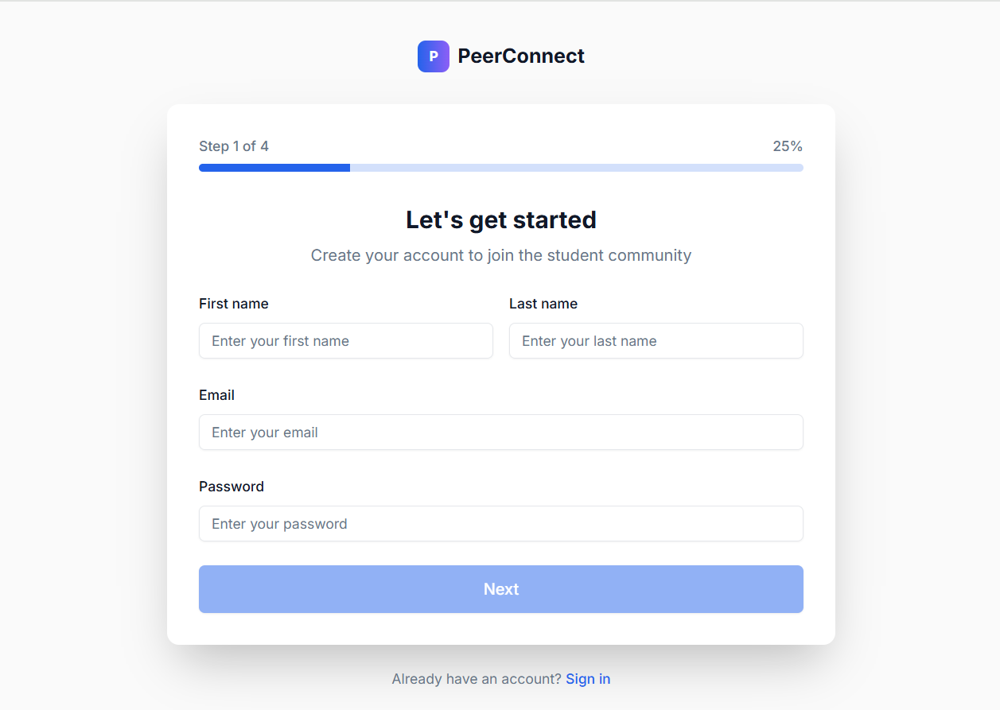
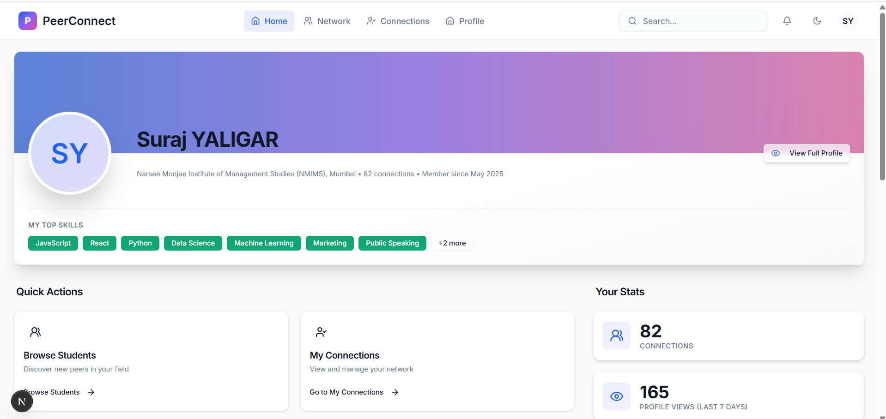
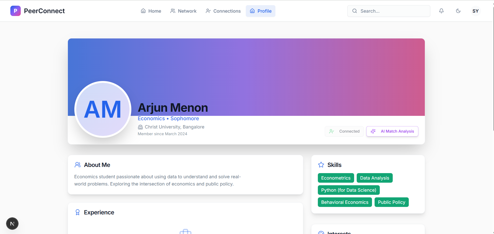
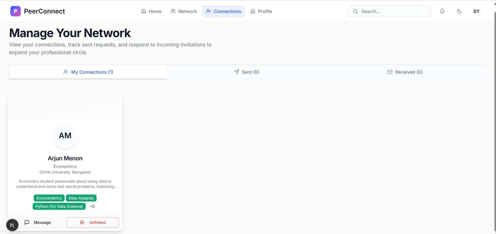

# PeerConnect - Student Networking Platform

[](https://nextjs.org/) [](https://tailwindcss.com/) [](https://ui.shadcn.com/) [](https://www.typescriptlang.org/)

**PeerConnect** is a student-centric networking platform meticulously designed to bridge the gap between students, fostering collaboration, and enabling the discovery of peers with shared interests and project goals. This frontend application aims to replicate key functionalities of professional networking sites like LinkedIn but is exclusively tailored for the unique needs and context of the student community. Our goal is to empower students to build meaningful connections, share knowledge, and embark on collaborative ventures within a supportive and focused environment.

## ✨ Features at a Glance

PeerConnect offers a comprehensive suite of features designed to enhance the student networking and collaboration experience:

-   **Intuitive Onboarding & Rich Profile Customization**: A seamless, multi-step onboarding process guides new users to create detailed profiles. Users can input personal information, academic credentials (college ID, year, department, university), showcase a portfolio of skills (technical and soft), list academic and extracurricular interests, and define areas for project collaboration. The platform also supports profile picture uploads to personalize user accounts.
-   **Personalized & Dynamic Dashboard**: Upon login, users are greeted with a personalized dashboard serving as their central hub. It features a welcoming message, at-a-glance statistics (e.g., connection count, profile views), quick action buttons for easy navigation to key sections (Browse Peers, View/Edit Profile, Manage Connections), a (simulated) feed of recent activities from their network, and intelligent (simulated) connection suggestions based on profile similarity or shared interests.
-   **Advanced Peer Discovery & Intelligent Filtering**: A powerful peer discovery module allows students to efficiently find and connect with others. Users can browse profiles in either a grid or list view, utilize an advanced search bar with debounced, real-time filtering, and apply a multitude of filters including department, academic year, specific skills, project interests, and university. Sorting options for search results (e.g., by newest members, most connections, or similarity of interests) further refine the discovery process.
-   **Comprehensive Connection Management System**: PeerConnect provides robust tools for users to build and manage their professional network. This includes an intuitive system for sending, receiving, and managing connection requests (accept/decline). Users can easily view their existing connections, search within their network, and (in future iterations) simulate messaging.
-   **Detailed Profile Management & Showcase**: Users have full control over their profiles. They can view their public profile as others see it, and easily edit and update all sections of their information. This includes adding or modifying skills, interests, project details, and linking to external social/professional profiles (e.g., LinkedIn, GitHub, personal portfolio).
-   **Dual Theme (Dark/Light Mode) & Accessibility**: To ensure a comfortable viewing experience in various lighting conditions and to cater to user preferences, PeerConnect offers a user-selectable theme (dark or light mode). This preference is saved locally and persists across browsing sessions, contributing to better accessibility.

## 🖼️ Screenshots (Light Theme)

*Illustrating the clean and user-friendly interface of PeerConnect.*

| Feature                 | Screenshot                                                                                             |
| :---------------------- | :----------------------------------------------------------------------------------------------------- |
| **Homepage**            |  <br> *The welcoming landing page for new and returning users.* |
| **Onboarding**          |  <br> *Intuitive multi-step onboarding process.* |
| **Dashboard**           |  <br> *Personalized user dashboard with key insights.* |
| **Peer Discovery**      | *No specific "browse" image provided. Using a general one.* <br>  <br> *Illustrative of profile cards seen in browse.* |
| **User Profile**        |  <br> *Detailed view of a student's profile.*        |
| **Connection Management**|  <br> *Interface for managing network connections.* |


## 🚀 Tech Stack & Design Philosophy

PeerConnect is built with a modern, robust, and scalable frontend architecture, prioritizing developer experience and user interface quality.

### Core Technologies:

-   **Framework**: [Next.js 14](https://nextjs.org/) (App Router) - Chosen for its hybrid static & server rendering, file-system routing, image optimization, and overall performance benefits, facilitating a fast and SEO-friendly application. The App Router enables a more organized and scalable project structure with server components and layouts.
-   **Styling**: [Tailwind CSS](https://tailwindcss.com/) - A utility-first CSS framework that allows for rapid UI development and consistent styling. It enables building custom designs without writing custom CSS and is highly configurable to match the project's design system.
-   **UI Components**: [Shadcn/ui](https://ui.shadcn.com/) - Not a component library, but a collection of re-usable components built using Radix UI and Tailwind CSS. These components are accessible, customizable, and can be copied directly into the project, offering full control over their code and styling.
-   **Animations**: [Framer Motion](https://www.framer.com/motion/) - A powerful React animation library used to create fluid, interactive, and engaging user experiences with minimal effort. It simplifies complex animations and transitions.
-   **Icons**: [Lucide React](https://lucide.dev/) - A comprehensive and simply beautiful open-source icon library. Provides a vast set of consistently designed SVG icons that are lightweight and easy to use.
-   **State Management**: React Context API + Local Storage - React Context is used for managing global UI state like themes and potentially user session information. Local Storage is leveraged for persisting user preferences (e.g., theme, view mode) and mock user data across browser sessions.
-   **Form Handling**: [React Hook Form](https://react-hook-form.com/) + [Zod](https://zod.dev/) - React Hook Form offers performant, flexible, and easy-to-use form building capabilities. Zod is used for schema declaration and validation, ensuring data integrity and providing excellent TypeScript support for type-safe forms.
-   **Typography**: Inter (via Google Fonts) - A highly legible and versatile font family designed specifically for user interfaces, ensuring clarity and a modern aesthetic.

### Additional Libraries & Tools:

-   **Toast Notifications**: [Sonner](https://sonner.emilkowal.ski/) - For displaying non-intrusive and customizable toast notifications for user actions (e.g., successful profile update, connection request sent).
-   **Client-Side Search**: [Fuse.js](https://fusejs.io/) - A lightweight yet powerful fuzzy-search library, enabling efficient client-side searching and filtering of student profiles or other data sets within the application.
-   **Utility Libraries**:
    -   `clsx` & `tailwind-merge`: Essential utilities for conditionally joining class names and resolving Tailwind CSS class conflicts, leading to cleaner component code.
    -   `date-fns`: A modern JavaScript date utility library for parsing, formatting, and manipulating dates in a simple and immutable way.

### Design System (Brief Overview):

-   **Color Palette**: A carefully selected color palette supports both light and dark themes, ensuring readability and visual appeal. Primary, secondary, accent, and status colors are defined as CSS variables for easy theming (see `src/app/globals.css`).
-   **Typography**: Consistent application of the Inter font family with a defined typographic scale (weights, sizes, line heights) for headings, body text, and captions to maintain visual hierarchy and readability.
-   **Layout & Spacing**: Adherence to a responsive grid system (likely using Tailwind's built-in grid) and a consistent spacing scale ensures a harmonious and adaptive layout across different screen sizes.
-   **Component Styling**: Components are styled using Tailwind CSS utilities, promoting reusability and consistency. Shadcn/ui components serve as a base, customized to fit the PeerConnect brand.

*(Refer to `PROJECT_PLAN.md` for a more detailed breakdown of the original design system concepts.)*

## 🎯 Core Functionality Deep Dive

This section provides a more detailed look into the primary modules and their functionalities as envisioned in the project plan:

### 1. Onboarding & Profile Creation (`/onboarding`)

-   **Objective**: To seamlessly guide new users through the process of creating a comprehensive and engaging professional profile.
-   **User Journey & Key Features**:
    -   **Multi-Step Form**: A user-friendly, multi-step wizard breaks down the profile creation process into manageable sections (e.g., Personal Info, Academic Details, Skills & Interests, Final Touches).
    -   **Progress Indication**: Visual feedback on progress (e.g., step indicator) keeps users informed and motivated.
    -   **Data Collection**:
        -   Personal Information: First name, last name, email (potentially for account creation).
        -   Academic Details: University, College ID, academic year/level, department/major.
        -   Skills & Interests: Interactive selection for technical skills, soft skills, academic interests, and extracurricular interests. This could involve tag-based input or selection from predefined lists.
        -   Project Collaboration Preferences: Areas where the student is looking to collaborate or projects they are interested in.
        -   Bio/Summary: A section for a personal statement or professional summary.
        -   Profile Picture: Simulated upload functionality with preview.
    -   **Real-time Validation**: Input fields are validated in real-time using Zod schemas, providing immediate feedback to users and ensuring data quality before submission.
-   **Key Components (from plan)**: `OnboardingWizard`, `StepIndicator`, `ProfileImageUpload` (simulation), `SkillsSelector`, `InterestsGrid`.

### 2. Dashboard Overview (`/dashboard`)

-   **Objective**: To provide users with a personalized and informative landing page post-login, offering a snapshot of their network activity and quick access to essential platform features.
-   **User Experience & Key Features**:
    -   **Personalized Welcome**: Greets the user by name.
    -   **Key Metrics**: Displays (simulated) statistics such as total connections, recent profile views, or new messages/notifications.
    -   **Quick Actions**: Prominent buttons or links for navigating to core sections like "Browse Peers," "View/Edit My Profile," and "Manage Connections."
    -   **Recent Activity Feed (Simulated)**: A list of recent, relevant activities from the user's network (e.g., "Priya Sharma updated her project," "Rohan Patel connected with Aisha Khan").
    -   **Connection Suggestions (Simulated)**: Cards or a list suggesting other students the user might want to connect with, based on shared interests, department, or skills.
    -   **(Future) Achievement Badges**: Section to display (simulated) badges for profile completion, number of connections, etc.
-   **Key Components (from plan)**: `DashboardStats`, `QuickActions`, `ActivityFeed`, `SuggestedConnections`.

### 3. Peer Discovery & Browsing (`/dashboard/browse`)

-   **Objective**: To empower users to efficiently discover, filter, and find other students based on a variety of criteria, facilitating new connections.
-   **User Interaction & Key Features**:
    -   **Dual View Modes**: Option to toggle between a grid view (visual cards) and a list view (more compact information) for displaying student profiles.
    -   **Advanced Search Bar**: A prominent search bar allowing users to search by name, keywords, skills, etc. Implements debouncing to provide real-time results as the user types without overwhelming the system.
    -   **Comprehensive Filtering Panel**: A collapsible or accessible panel with multiple filter categories:
        -   Academic: Department, year/level, university (if multi-campus).
        -   Skills: Technical skills, soft skills.
        -   Interests: Academic or extracurricular interests.
        -   Project Areas: Specific areas of project collaboration.
    -   **Active Filter Indicators**: Clearly displays currently applied filters (e.g., "filter chips") with an option to easily remove them.
    -   **Sorting Options**: Allows users to sort the displayed profiles by criteria such as "Newest Members," "Most Connections," "Profile Relevance," or "Shared Interests."
    -   **Student Profile Cards**: Each student in the search results is displayed using a concise `StudentCard` component, showing key information (name, avatar, department, key skills/interests) and a "Connect" button.
    -   **(Future) Infinite Scroll/Pagination**: Efficiently loads more profiles as the user scrolls or navigates through pages, for better performance with large datasets.
-   **Key Components (from plan)**: `SearchBar`, `FilterPanel`, `ViewToggle`, `StudentCard`, `FilterChips`.

### 4. Connection Management (`/dashboard/connections`)

-   **Objective**: To provide a centralized interface for users to manage all aspects of their professional network within PeerConnect.
-   **User Interface & Key Features**:
    -   **Tabbed Navigation**: Typically organized into tabs like "My Connections" (displaying all accepted connections), "Received Requests" (pending requests from other users), and "Sent Requests" (requests initiated by the user that are pending).
    -   **Request Handling**: For received requests, users can "Accept" or "Decline."
    -   **Connection Actions**: For existing connections, users can "View Profile" or "Remove Connection."
    -   **Search Within Connections**: Ability to search/filter through their list of existing connections.
    -   **(Future) Message Simulation**: Placeholder or entry point for a simulated messaging feature with connected peers.
-   **Key Components (from plan)**: `ConnectionTabs`, `ConnectionCard` (for established connections), `RequestCard` (for pending requests), `ConnectionActions` (buttons for accept/decline/remove).

### 5. Profile Viewing & Editing (`/dashboard/profile/:userId`)

-   **Objective**: To allow users to present a comprehensive professional profile to their peers and to easily maintain and update their information.
-   **User Perspective & Key Features**:
    -   **Public Profile View**: Displays how the user's profile appears to other students on the platform.
    -   **Profile Sections**: Clearly delineated sections for:
        -   Header: Avatar, name, headline/current role (e.g., "Computer Engineering Student"), location.
        -   About/Bio: Detailed personal summary.
        -   Experience (Simulated): Internships, part-time jobs, volunteer work.
        -   Education: Academic history (if multiple institutions).
        -   Skills: Categorized list of skills.
        -   Interests: List of academic and extracurricular interests.
        -   Projects: Showcase of personal or academic projects with descriptions, technologies used, and links.
        -   Social Links: Links to external profiles (LinkedIn, GitHub, Portfolio).
    -   **Edit Mode**: When viewing their own profile, users can switch to an "Edit Mode" to modify any section. This might involve inline editing or dedicated forms for each section.
    -   **Profile Completeness (Simulated)**: A visual indicator (e.g., progress bar) encouraging users to fill out all relevant sections of their profile.
    -   **Skills Endorsement (Simulated)**: A feature where connections can "endorse" skills listed on a user's profile.
-   **Key Components (from plan)**: `ProfileHeader`, `ProfileEditor` (or individual section edit components), `SkillsList`, `ProjectShowcaseCard`, `ExperienceCard`.


## 🏗️ Project Structure Explained

The project follows a standard Next.js App Router structure, organized for clarity, scalability, and maintainability.

```
peerconnect/
├── app/                      # Core of the Next.js application using the App Router
│   ├── (main)/               # Route group for main authenticated app pages
│   │   ├── dashboard/        # Dashboard related routes and components
│   │   │   ├── layout.tsx    # Layout specific to the dashboard section (header, sidebar, etc.)
│   │   │   ├── page.tsx      # Main dashboard page (/dashboard)
│   │   │   ├── browse/       # Peer browsing pages (/dashboard/browse)
│   │   │   ├── connections/  # Connection management pages (/dashboard/connections)
│   │   │   └── profile/      # User profile pages (e.g., /dashboard/profile/[userId])
│   │   └── ...               # Other main authenticated routes
│   ├── (auth)/               # Route group for authentication-related pages
│   │   └── onboarding/       # Onboarding flow pages (/onboarding)
│   │       └── page.tsx
│   ├── globals.css           # Global stylesheets, Tailwind directives, CSS variables for themes
│   ├── layout.tsx            # Root layout component for the entire application (html, body tags, global context providers)
│   └── page.tsx              # Landing page of the application (homepage, accessible to all users)
│
├── components/               # Shared and reusable React components, organized by scope or feature
│   ├── ui/                   # Core UI elements, often customized versions of Shadcn/ui components (Button, Card, Input, Dialog, etc.)
│   ├── layout/               # Components specific to page layouts (e.g., MainHeader, DashboardSidebar, PageFooter)
│   ├── common/               # General-purpose common components (e.g., LoadingSpinner, EmptyStateMessage, AvatarDisplay)
│   └── features/             # Components specific to certain application features/modules
│       ├── profile/          # E.g., ProfileCard, ProfileForm, SkillTag
│       ├── dashboard/        # E.g., StatsCard, QuickActionButton
│       ├── browse/           # E.g., StudentCard, SearchFiltersPanel
│       └── connections/      # E.g., ConnectionRequestCard
│
├── contexts/                 # React Context API providers for managing global or widely shared state
│   ├── ThemeContext.tsx      # Manages application-wide theme (light/dark mode) and persistence
│   └── ConnectionsContext.tsx # Example: Manages state related to user connections and requests
│
├── lib/                      # Utility functions, helper scripts, type definitions, and constants
│   ├── utils.ts              # General utility functions (e.g., cn for class names, date formatters, data transformers)
│   ├── types.ts              # TypeScript type definitions, interfaces for data structures and component props
│   ├── constants.ts          # Application-wide constants (e.g., navigation items, API routes if static, default values)
│   ├── localStorage.ts       # Abstraction layer for interacting with browser's localStorage (get/set/remove items)
│   └── mockData.ts           # Mock data for users, profiles, connections, etc., for development and UI population
│
├── hooks/                    # Custom React Hooks for encapsulating and reusing stateful logic
│   ├── useTheme.ts           # (If useTheme is separate) Hook to conveniently access theme context values
│   ├── useLocalStorage.ts    # Example: A generic hook for managing state synced with localStorage
│   └── useDebounce.ts        # Example: Hook for debouncing input values (e.g., for search bars)
│
└── public/                   # Static assets served directly from the web root
    ├── avatars/              # Default or placeholder user avatars
    └── images/               # Other static images, logos, or assets used in the application
    └── fonts/                # (If self-hosting fonts) Font files

```
*(This structure is an illustrative example based on common best practices and can be adapted. For the most current and detailed structure map, always refer to the `PROJECT_PLAN.md` or explore the codebase directly.)*

## ⚙️ Getting Started

### Prerequisites

-   **Node.js**: v18.x or newer is recommended for compatibility with modern JavaScript features and Next.js.
-   **Package Manager**: Your choice of npm (comes with Node.js), yarn, pnpm, or bun.

### Installation

1.  **Clone the repository** (replace `<your-repository-url>` with the actual URL):
    ```bash
    git clone <your-repository-url>
    cd peerconnect
    ```

2.  **Install dependencies** using your preferred package manager:
    ```bash
    npm install
    # or
    # yarn install
    # or
    # pnpm install
    # or
    # bun install
    ```

### Running the Development Server

To start the Next.js development server:

```bash
npm run dev
# or
yarn dev
# or
pnpm dev
# or
bun dev
```

Open [http://localhost:3000](http://localhost:3000) in your browser to view the application. The development server supports Fast Refresh, so changes made to source files (primarily within the `app/` and `components/` directories) will be reflected in the browser almost instantly.

## 🤝 Contributing

We welcome contributions to PeerConnect! If you're interested in helping improve the platform, please consider the following guidelines:

1.  **Fork the Repository**: Create your personal copy of the project on GitHub.
2.  **Create a Feature Branch**: Before starting work, create a new branch from `main` (or `develop`, if used) for your feature or bug fix:
    `git checkout -b feature/your-descriptive-feature-name`
    or for a bug fix:
    `git checkout -b fix/issue-description-or-number`
3.  **Develop**: Implement your feature or bug fix. Ensure your code adheres to the project's coding style and conventions.
4.  **Commit Your Changes**: Make clear, concise, and conventional commit messages. For example:
    `git commit -m 'feat(profile): Add project showcase section'`
    `git commit -m 'fix(dashboard): Correct connection count display'`
5.  **Push to Your Branch**: `git push origin feature/your-descriptive-feature-name`
6.  **Open a Pull Request (PR)**: Submit a PR from your feature branch to the `main` (or `develop`) branch of the original repository. Provide a clear description of the changes and any relevant context.

Please ensure that your code is well-tested (if automated tests are part of the project) and that any new features or changes are documented appropriately.

## 📜 License

This project is currently not licensed. (Or specify: This project is licensed under the MIT License - see the `LICENSE.md` file for details.)

## 📞 Contact

Your Name - your.email@example.com

Project Link: [https://github.com/your-username/peerconnect](https://github.com/your-username/peerconnect)
